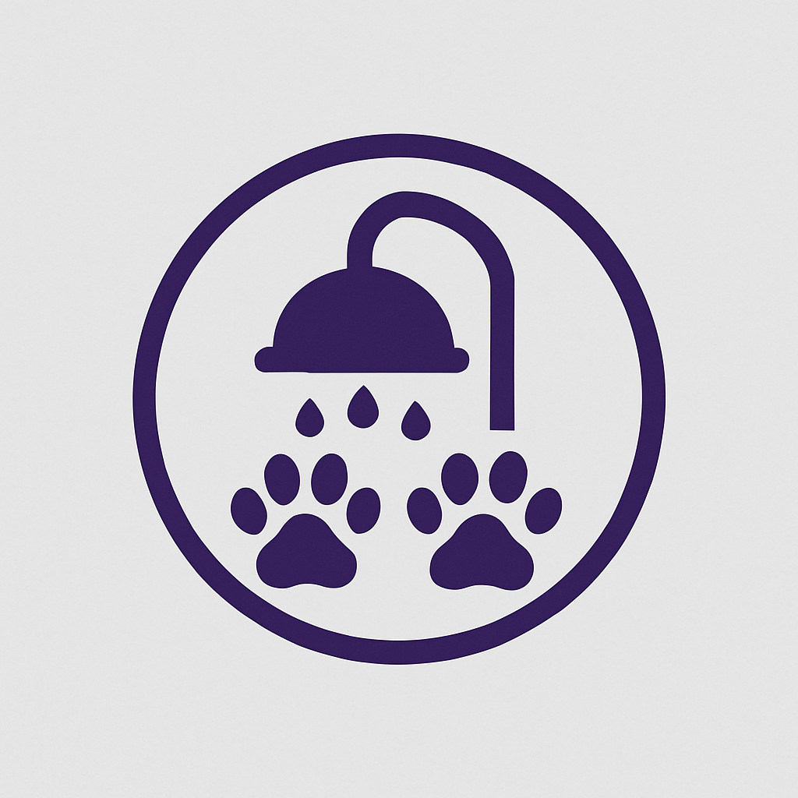

<p align="center"><a href="https://laravel.com" target="_blank"></a></p>

<p align="center">
<a href="https://github.com/laravel/framework/actions"></a>
<a href="https://packagist.org/packages/laravel/framework"></a>
<a href="https://packagist.org/packages/laravel/framework"></a>
<a href="https://packagist.org/packages/laravel/framework"></a>
</p>

# PetShop

Sistema de gerenciamento de pets para pequenos petshops, construído com Laravel.



## 

## Descrição

O PetShop é uma aplicação web projetada para auxiliar pequenos petshops no gerenciamento eficiente de suas operações. Desenvolvido com o framework Laravel, o sistema oferece uma interface intuitiva para gerenciar usuários, cadastrar donos e seus pets, agendar consultas e acompanhar tratamentos e históricos médicos.

## Funcionalidades

- Criação e gerenciamento de usuários
- Cadastro de donos de pets
- Registro de pets
- Agendamento e gerenciamento de consultas
- Acompanhamento de tratamentos e registros médicos

## Requisitos

- PHP 8.4 ou superior
- Docker
- Composer
- Laravel Sail

## Instalação

1. Clone o repositório:

   ```bash
   git clone https://github.com/ViniciusBelem/app_2a.git
   cd app_2a
   ```

2. Instale as dependências:

   ```bash
   composer install
   ```

3. Copie o arquivo `.env.example` para `.env`:

   ```bash
   cp .env.example .env
   ```

4. Gere a chave da aplicação:

   ```bash
   ./vendor/bin/sail artisan key:generate
   ```

5. Inicie o ambiente com Sail:

   ```bash
   ./vendor/bin/sail up -d
   ```

   **Nota**: Certifique-se de que o Docker está em execução. Pode levar alguns momentos para os contêineres iniciarem.

6. Execute as migrações do banco de dados:

   ```bash
   ./vendor/bin/sail artisan migrate
   ```

7. (Opcional) Popule o banco de dados com dados fictícios:

   ```bash
   ./vendor/bin/sail artisan db:seed
   ```

8. Acesse a aplicação em http://localhost.

## Uso

Após a instalação, acesse a aplicação em http://localhost no seu navegador. A partir daí, você pode:

- Criar uma nova conta de usuário
- Cadastrar donos e seus pets
- Agendar consultas
- Registrar tratamentos e históricos médicos

A interface é intuitiva, permitindo navegação fácil pelas funcionalidades através dos menus disponíveis.

## Contribuição

Agradecemos contribuições para o projeto PetShop. Para contribuir:

1. Faça um fork do repositório

2. Crie uma nova branch para sua funcionalidade ou correção

3. Commit suas alterações

4. Envie para sua branch

5. Crie um pull request

Certifique-se de que seu código segue os padrões de codificação do projeto e inclui testes apropriados.

## 

## Autores

- Kinberly - kinberly.santos@estudante.ifto.edu.br
- Maria Eduarda - maria.anjos@estudante.ifto.edu.br
- Sara - sara.silva22@estudante.ifto.edu.br

Para quaisquer dúvidas, entre em contato com os autores por e-mail.
